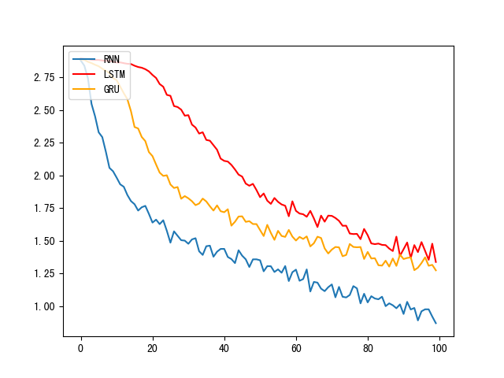
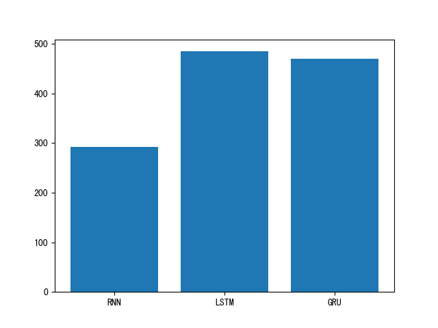
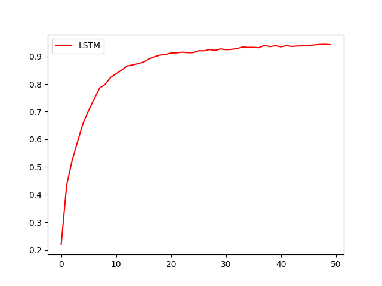
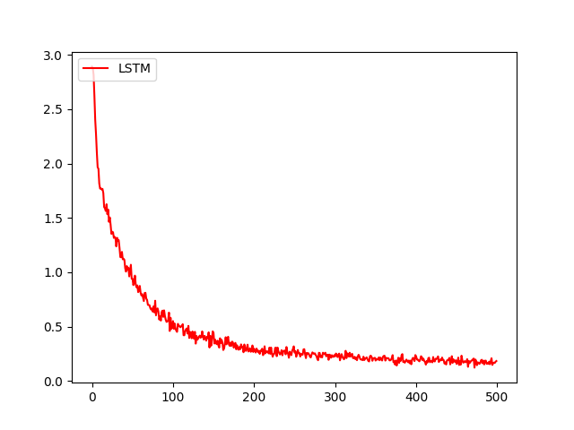
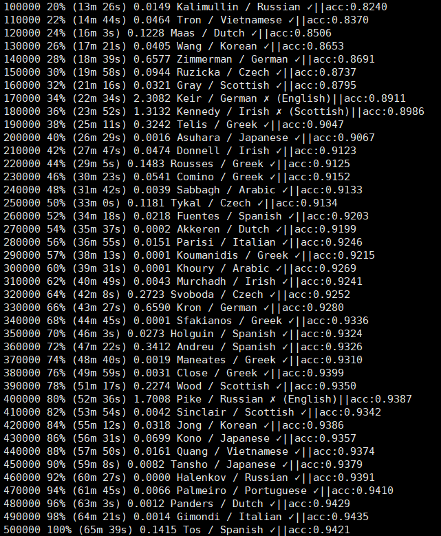
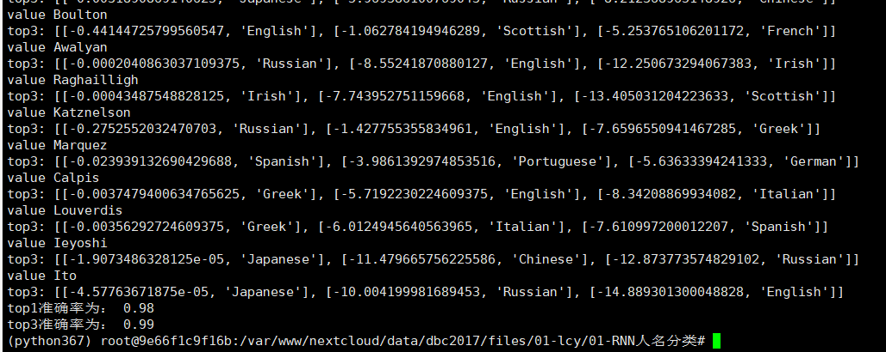

# NameClassifier

# 关于人名分类问题:
* 以一个人名为输入, 使用模型帮助我们判断它最有可能是来自哪一个国家的人名, 这在某些国际化公司的业务中具有重要意义, 在用户注册过程中, 会根据用户填写的名字直接给他分配可能的国家或地区选项, 以及该国家或地区的国旗, 限制手机号码位数等等.

# 2 人名分类数据:

* 数据下载地址: https://download.pytorch.org/tutorial/data.zip
* 数据文件预览:
- data/
- names/
    Arabic.txt
    Chinese.txt
    Czech.txt
    Dutch.txt
    English.txt
    French.txt
    German.txt
    Greek.txt
    Irish.txt
    Italian.txt
    Japanese.txt
    Korean.txt
    Polish.txt
    Portuguese.txt
    Russian.txt
    Scottish.txt
    Spanish.txt
    Vietnamese.txt
* Chiness.txt预览:

AngAu-YongBaiBanBaoBeiBianBuiCaiCaoCenChaiChaimChanChangChaoCheChenCheng

# 3 整个案例的实现可分为以下五个步骤:

* 第一步: 导入必备的工具包.
* 第二步: 对data文件中的数据进行处理，满足训练要求.
* 第三步: 构建RNN模型(包括传统RNN, LSTM以及GRU).
* 第四步: 构建训练函数并进行训练.
* 第五步: 构建评估函数并进行预测.

# 训练结果
## RNN,LSTM,GRU对比
* 损失对比

* 训练时长对比

## LSTM
* LSTM准确率

* LSTM损失

## 结果
* 训练打印结果

* 验证集预测结果

